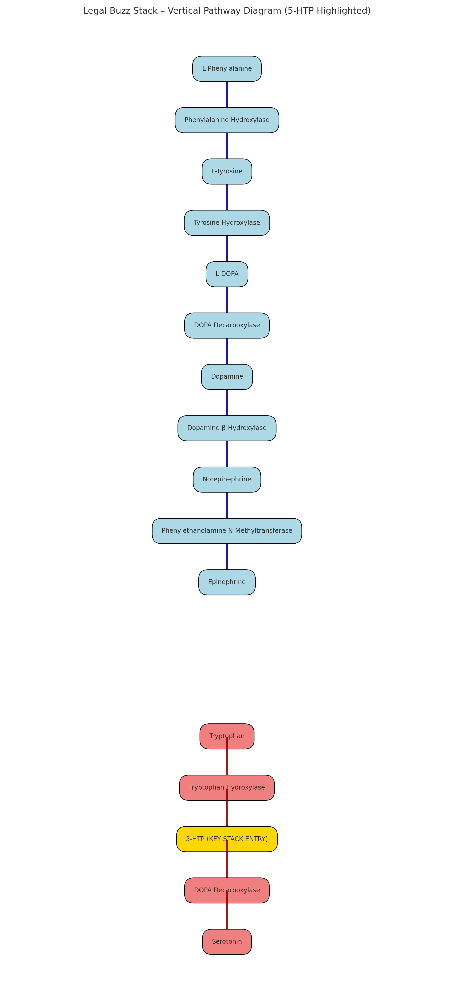

# Legal Buzz Stack: Pathway Diagram

---

## Dopamine Pathway

1. **L-Phenylalanine**  
   → Hydroxylated to **L-Tyrosine**  
2. **L-Tyrosine**  
   → Converted by Tyrosine Hydroxylase into **L-DOPA**  
3. **L-DOPA**  
   → Decarboxylated into **Dopamine**  
4. **Dopamine**  
   → β-Hydroxylated into **Norepinephrine**  
5. **Norepinephrine**  
   → Methylated into **Epinephrine**

---

## Serotonin Pathway

1. **Tryptophan**  
   → Hydroxylated into **5-HTP**  
2. **5-HTP (KEY STACK ENTRY)**  
   → Decarboxylated into **Serotonin**

> **Note:**  
> The Legal Buzz Stack supports both pathways using DLPA, PEA, ALCAR, Hordenine, and 5-HTP.  
> 5-HTP is the **core serotonergic modulator**, balancing excess dopaminergic drive and enhancing mood stability.

---

## Stack Integration Points

- **DLPA, L-Tyrosine, and PEA** → feed into the dopamine side  
- **5-HTP** → directly boosts serotonin  
- **Hordenine** → extends the life of PEA by inhibiting MAO-B  
- **ALCAR** → energizes and supports neurotransmission
